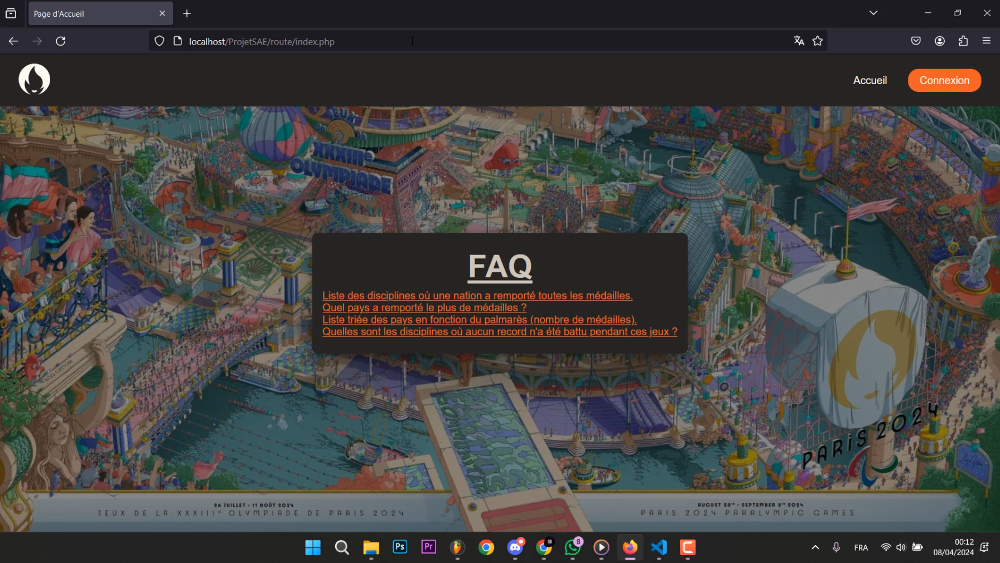
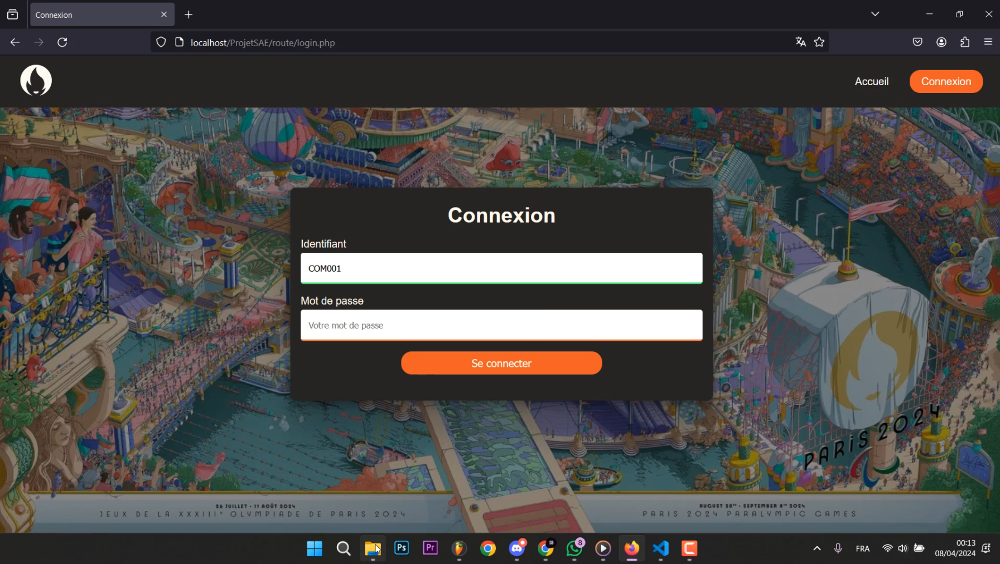
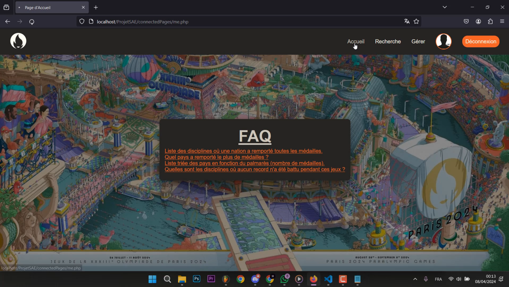
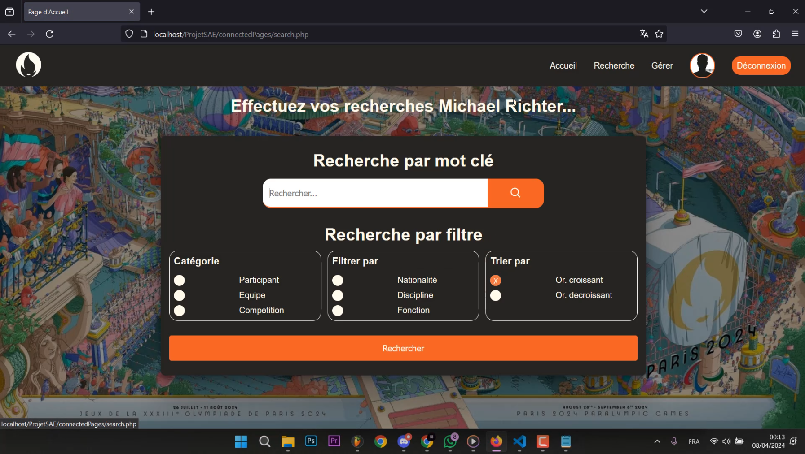
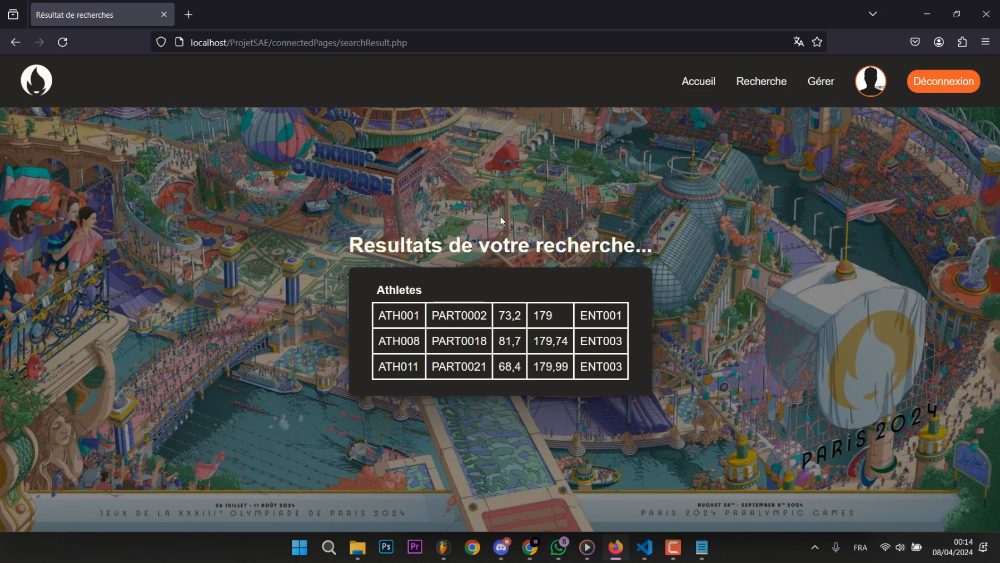
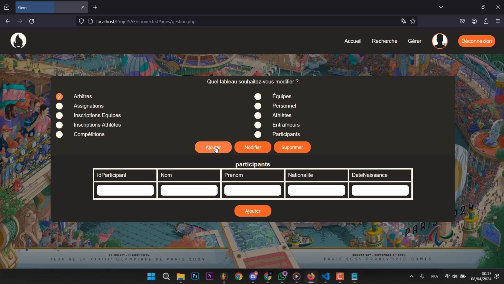
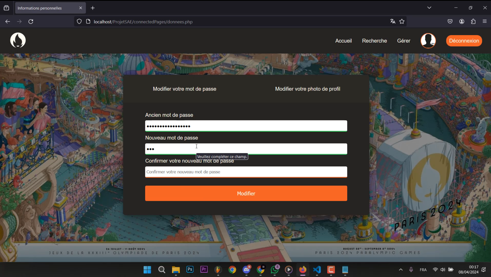

# Projet de Site Web pour la Gestion des Participants des Jeux Olympiques 2024

Ce projet implémente un site web pour la gestion des utilisateurs d'un comité, permettant aux utilisateurs de se connecter, de modifier leurs informations personnelles et de gérer leur profil.

## Objectif du projet

L'objectif de ce projet est de fournir une interface web où les membres d'un comité peuvent se connecter et gérer leurs informations personnelles, telles que le mot de passe et la photo de profil. Ils peuvent également faire des recherches dans la base de données de l'organisation, ajouter des participants, des compétitions, les modifier ainsi que les supprimer. Le site utilise PHP pour le backend et intègre une base de données Oracle pour la gestion des données utilisateur et des participants.

## Aperçu

## Fonctionnalités

- **Connexion utilisateur** : Les utilisateurs peuvent se connecter à l'aide de leur identifiant et mot de passe.
- **Modification du mot de passe** : Les utilisateurs peuvent changer leur mot de passe après vérification de l'ancien mot de passe.
- **Changement de photo de profil** : Les utilisateurs peuvent télécharger une nouvelle photo de profil.
- **Gestion de session** : Le site utilise des sessions pour garder les utilisateurs connectés pendant leur navigation.
- **Messages d'erreur** : Affichage de messages d'erreur appropriés lors des échecs de connexion ou des validations de formulaire.
- **Recherche de participants** : Les utilisateurs peuvent rechercher des athlètes et des compétitions par nom, date ou d'autres critères pertinents.
- **Gestion des participants** : Les utilisateurs peuvent ajouter, modifier ou supprimer des informations sur les participants aux Jeux Olympiques.
- **Navigation** : Menu permettant d'accéder aux différentes sections du site : Accueil, Recherche, Gérer, Données (avec image de profil), Déconnexion.
- **Affichage des résultats de recherche** : Présentation des résultats de recherche dans des tables dynamiques.
- **Filtrage des données** : Options de filtrage pour les participants, équipes, et compétitions basées sur divers critères comme la nationalité et la fonction.

## Structure des fichiers

- **login.php** : Page de connexion qui gère l'authentification des utilisateurs.
- **me.php** : Page principale après connexion où les utilisateurs peuvent voir et modifier leurs informations personnelles.
- **donnees.php** : Page pour traiter les modifications de mot de passe et de photo de profil.
- **gestion.php** : Page dédiée à la gestion des participants, permettant d'ajouter, modifier et supprimer des informations.
- **recherche.php** : Page pour effectuer des recherches dans la base de données des participants et des compétitions.
- **logout.php** : Gère la déconnexion des utilisateurs en détruisant la session.
- **style.css** : Feuille de style pour la mise en forme du site.
- **script.js** : Scripts JavaScript pour des fonctionnalités supplémentaires et des interactions dynamiques.

## Algorithme de connexion

L'algorithme de connexion fonctionne de la manière suivante :

1. **Validation des informations d'identification** :
   - Lorsqu'un utilisateur soumet le formulaire de connexion, le système vérifie les identifiants fournis contre les données stockées dans la base de données.
   - Le mot de passe est haché à l'aide de MD5 avant d'être comparé à la version stockée en base.

2. **Gestion de session** :
   - Si l'authentification est réussie, une session est créée pour l'utilisateur, et il est redirigé vers la page principale.
   - Si l'authentification échoue, un message d'erreur est affiché.

3. **Modification des informations utilisateur** :
   - Lorsqu'un utilisateur modifie son mot de passe ou sa photo de profil, le système effectue des validations pour s'assurer que les entrées sont correctes avant de mettre à jour la base de données.

4. **Recherche et gestion des participants** :
   - Les utilisateurs peuvent rechercher des participants ou des compétitions via une interface dédiée.
   - Les résultats de la recherche permettent d'accéder rapidement aux informations pertinentes pour modification ou suppression.

## Instructions de Déploiement

1. **Configuration de l'environnement** :
   - Assurez-vous d'avoir un serveur PHP et une base de données Oracle opérationnels.
   - Mettez à jour les paramètres de connexion à la base de données dans le fichier `myparam.inc.php`.

2. **Déploiement du site** :
   - Téléversez tous les fichiers du projet sur votre serveur web.
   - Accédez à `login.php` pour tester la connexion et les fonctionnalités.

## Technologies Utilisées

- **PHP** : Langage de script pour le développement du backend.
- **HTML/CSS** : Technologies de base pour le développement de l'interface utilisateur.
- **JavaScript** : Utilisé pour des interactions dynamiques sur le site.
- **Oracle** : Système de gestion de base de données pour le stockage des informations utilisateur.

## Contributeurs

- [elyes06](https://github.com/elyes06)
